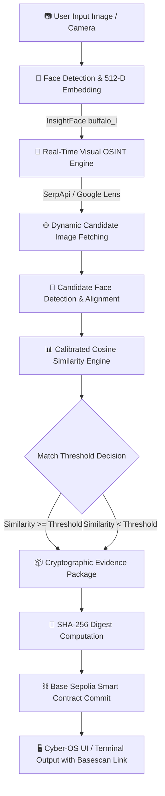

<div align="center">

# ⚡ TRACEON / VERIFAI

### Multimodal Biometric Intelligence & Cryptographic Evidence Anchoring Pipeline

[-0052FF?style=flat-square&logo=ethereum&logoColor=white)](https://sepolia.basescan.org/address/0x49964d2a0E9A8359F3b8b5655f2067C88145A0Fe)
[](https://verifai-backend-2tnw.onrender.com)
[](https://frontend-kappa-five-39.vercel.app)
[](https://github.com/deepinsight/insightface)
[](LICENSE)

<p align="center">
  <b>An end-to-end OSINT and facial identity verification system that extracts 512-D deep biometric embeddings, performs live reverse-image discovery across indexed web platforms, calculates calibrated cosine similarity, packages cryptographic evidence packages, and permanently commits proof records onto the Base Sepolia Layer-2 blockchain.</b>
</p>

[🌐 Live Web Dashboard](https://frontend-kappa-five-39.vercel.app) • [📡 Live Backend API](https://verifai-backend-2tnw.onrender.com/api/health) • [📜 Smart Contract on Basescan](https://sepolia.basescan.org/address/0x49964d2a0E9A8359F3b8b5655f2067C88145A0Fe)

</div>

---

## 🌐 Live Deployments & Network Details

| Component | Platform | Status | URL / Identifier |
| :--- | :--- | :---: | :--- |
| **Frontend Web App** | Vercel | `Production` | [frontend-kappa-five-39.vercel.app](https://frontend-kappa-five-39.vercel.app) |
| **Backend REST API** | Render | `Live` | [verifai-backend-2tnw.onrender.com](https://verifai-backend-2tnw.onrender.com) |
| **API Health Check** | Render | `Healthy` | [`/api/health`](https://verifai-backend-2tnw.onrender.com/api/health) |
| **Smart Contract** | Base Sepolia | `Verified` | [`0x49964d2a0E9A8359F3b8b5655f2067C88145A0Fe`](https://sepolia.basescan.org/address/0x49964d2a0E9A8359F3b8b5655f2067C88145A0Fe) |
| **Network Chain ID** | Base Sepolia | `84532` | RPC: `https://sepolia.base.org` |

---

## 🏗️ System Architecture & Workflow



---

## 🎯 Core Features & Pipeline Breakdown

### 1. 🧠 Biometric Face Detection & Deep Feature Encoding
- Powered by **`InsightFace` (`buffalo_l` model)** and **`ONNX Runtime`**.
- Localizes facial keypoints (5 landmarks), applies spatial transformation/alignment, and extracts normalized **512-dimensional biometric feature embeddings**.

### 2. 🔎 Real-Time Reverse-Image Search (OSINT)
- Genuine, un-mocked visual discovery engine using Google Lens / SerpApi.
- Crawls publicly indexed platforms (LinkedIn, Twitter/X, Instagram, Facebook, Reddit, VK, and public web directories) to gather candidate profile matches.

### 3. 📊 Calibrated Facial Verification & Decision Engine
- Evaluates pairwise angular cosine distance between query embeddings and discovered candidate crops.
- Employs calibrated confidence thresholds to make deterministic `MATCH` vs. `NO_MATCH` classifications with granular similarity percentages.

### 4. 📦 Cryptographic Evidence Manifest
- Automatically generates canonical, structured JSON evidence containing:
  - Input image SHA-256 fingerprint
  - Best matched candidate image SHA-256 digest
  - Match score, cosine similarity, and decision outcome
  - Source URL and extraction timestamp
- Generates a root **`evidenceHash` (`bytes32`)** digest.

### 5. ⛓️ Immutable Blockchain Anchoring (Base Sepolia L2)
- Submits and permanently registers the `evidenceHash` and similarity score to the `EvidenceRegistry.sol` contract deployed on **Base Sepolia**.
- Generates an on-chain transaction receipt verifiable on [Base Sepolia Basescan](https://sepolia.basescan.org/).

### 6. 💻 Cyber-OS Web Interface & Standalone CLI
- **Frontend Dashboard**: Futuristic terminal aesthetic built with React, Vite, and TypeScript featuring real-time pipeline visualizers, similarity dials, metadata viewers, and camera capture.
- **Standalone CLI**: Full end-to-end Python pipeline runnable directly from the command line (`backend/main.py`).

---

## ⛓️ Blockchain & Smart Contract Specification

- **Target Blockchain**: Base Sepolia Testnet (Ethereum Layer-2)
- **Contract Name**: `EvidenceRegistry` ([`contracts/EvidenceRegistry.sol`](./contracts/EvidenceRegistry.sol))
- **Contract Address**: [`0x49964d2a0E9A8359F3b8b5655f2067C88145A0Fe`](https://sepolia.basescan.org/address/0x49964d2a0E9A8359F3b8b5655f2067C88145A0Fe)
- **Explorer**: [Base Sepolia Basescan](https://sepolia.basescan.org/address/0x49964d2a0E9A8359F3b8b5655f2067C88145A0Fe)

### On-Chain Event Signature
```solidity
event EvidenceLogged(
    bytes32 indexed evidenceHash,
    uint256 similarity,
    uint256 timestamp,
    address indexed submitter
);
```

### On-Chain Query Function
```solidity
function verifyEvidence(bytes32 evidenceHash) external view returns (
    bool exists,
    uint256 similarity,
    uint256 timestamp,
    address submitter
);
```

---

## 📡 REST API Reference

The backend is built with FastAPI and runs on ASGI Uvicorn:

### `GET /api/health`
Checks server status and connected blockchain configuration.
```json
{
  "status": "online",
  "chain_id": 84532,
  "contract_address": "0x49964d2a0E9A8359F3b8b5655f2067C88145A0Fe",
  "network": "Base Sepolia"
}
```

### `POST /api/verify`
Executes the full forensic verification pipeline.
- **Content-Type**: `multipart/form-data`
- **Body**: `image` (binary file: JPG, PNG, WEBP)
- **Response**:
```json
{
  "success": true,
  "decision": "MATCH",
  "similarity": 0.8842,
  "similarity_percent": 88.42,
  "source_url": "https://...",
  "evidence_hash": "0x...",
  "blockchain": {
    "tx_hash": "0x...",
    "contract": "0x49964d2a0E9A8359F3b8b5655f2067C88145A0Fe",
    "network": "Base Sepolia",
    "basescan_url": "https://sepolia.basescan.org/tx/0x..."
  }
}
```

---

## 📂 Repository Structure

```
├── backend/
│   ├── api.py                    # FastAPI REST server
│   ├── main.py                   # Standalone CLI entrypoint
│   ├── blockchain/
│   │   ├── client.py             # Web3 client for Base Sepolia
│   │   └── deploy.py             # Contract deployment script
│   ├── face/
│   │   ├── detector.py           # InsightFace detection & landmarks
│   │   └── embedder.py           # 512-D embedding extraction
│   ├── search/
│   │   └── engine.py             # SerpApi / Google Lens visual search
│   ├── matching/
│   │   └── matcher.py            # Cosine similarity matching engine
│   ├── evidence/
│   │   └── builder.py            # Cryptographic evidence manifest packaging
│   └── orchestrator/
│       └── pipeline.py           # Pipeline coordination
├── contracts/
│   └── EvidenceRegistry.sol      # Solidity smart contract
├── frontend/
│   ├── src/
│   │   ├── components/           # UI components (Dropzone, Results, Visualizer)
│   │   ├── services/             # API client & health check polling
│   │   └── types/                # TypeScript type definitions
│   ├── vite.config.ts            # Vite proxy & bundler configuration
│   └── package.json
├── render.yaml                   # Render deployment configuration
├── vercel.json                   # Vercel deployment & proxy rewrites
└── requirements.txt              # Backend Python dependencies
```

---

## 🚀 Local Installation & Quick Start

### 1. Prerequisites
- **Python**: `3.10` or higher
- **Node.js**: `18.0` or higher
- **Git**

### 2. Setup Backend Environment
```bash
# Clone the repository
git clone https://github.com/GigaSachin/TraceOn.git
cd TraceOn

# Create & activate virtual environment
python -m venv .venv

# Windows:
.venv\Scripts\activate
# Linux / macOS:
source .venv/bin/activate

# Install dependencies
pip install -r requirements.txt
```

### 3. Configure Environment Variables
Create a `.env` file in the root directory:
```ini
SERPAPI_KEY=your_serpapi_api_key
BASE_SEPOLIA_RPC=https://sepolia.base.org
BASE_SEPOLIA_CHAIN_ID=84532
PRIVATE_KEY=your_evm_wallet_private_key
CONTRACT_ADDRESS=0x49964d2a0E9A8359F3b8b5655f2067C88145A0Fe
```

---

### 4. Running the Application

#### Option A: Interactive CLI Pipeline
```bash
python backend/main.py
```
*Prompt will ask for image path (e.g. `backend/test_same.jpg`).*

#### Option B: Full-Stack Web Application (Local)

**Terminal 1 — Backend:**
```bash
python -m uvicorn backend.api:app --host 127.0.0.1 --port 8000 --reload
```

**Terminal 2 — Frontend:**
```bash
cd frontend
npm install
npm run dev
```
Open **[http://localhost:5173](http://localhost:5173)** in your browser.

---

## 🧪 Running Automated Tests

Run the test suite to validate pipeline calibration, face matching, and blockchain modules:
```bash
pytest backend/ -v
```

---

## ⚠️ Operational Considerations & Limitations

1. **OSINT Indexing & Rate Limits**:
   - Google Lens & OSINT engines index public web crawlers. Brand-new private photos or non-public images will not return matches.
   - Search request throughput is subject to SerpApi quota limits.
2. **Extreme Facial Angles & Lighting**:
   - Heavy occlusions (face masks, dark sunglasses), severe motion blur, or low-resolution crops (< 60×60 px) may decrease detection confidence.
3. **Testnet Gas & Confirmation**:
   - On-chain submission speed is governed by Base Sepolia block confirmation latency (~2–4 seconds). Deployer wallet must maintain testnet ETH.
4. **Biometric Drift**:
   - Substantial cosmetic surgeries or aging discrepancies across decades naturally reduce cosine similarity scores.

---

## 📄 License
This project is licensed under the [MIT License](LICENSE).
